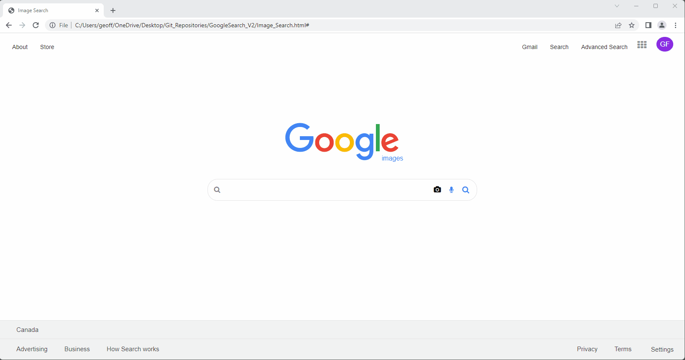
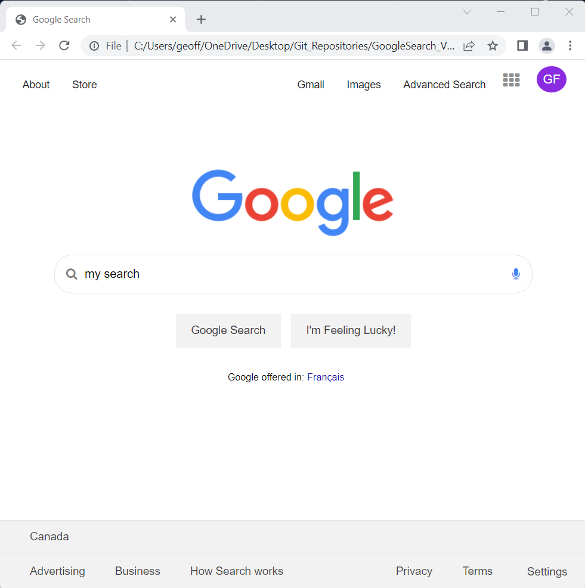
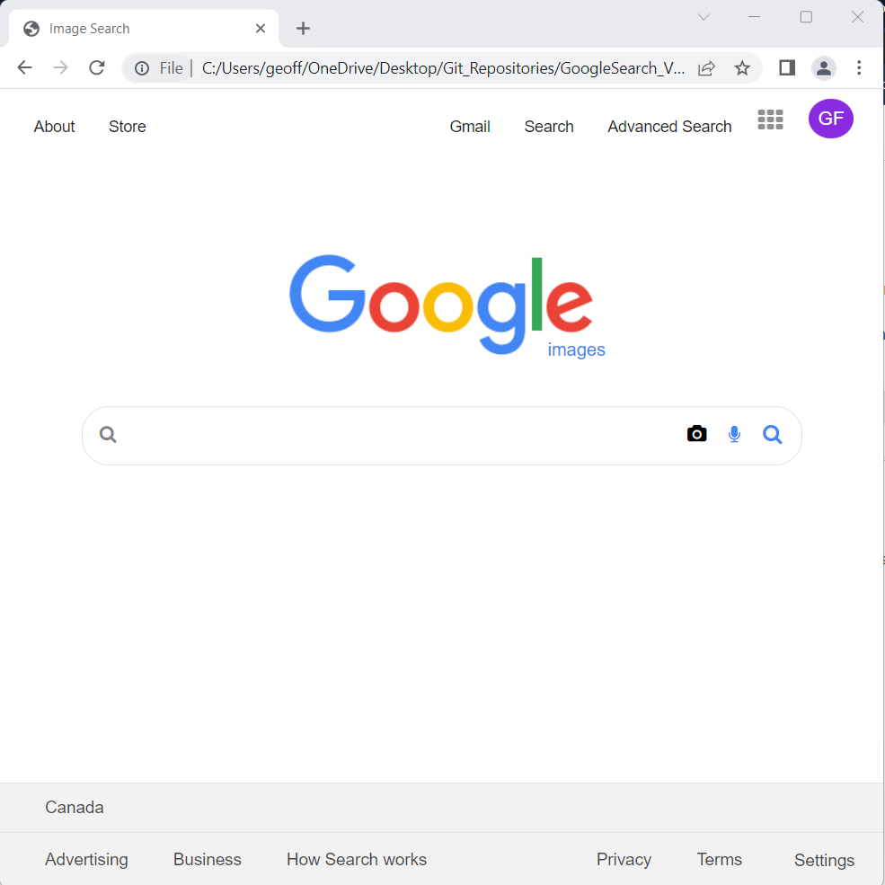
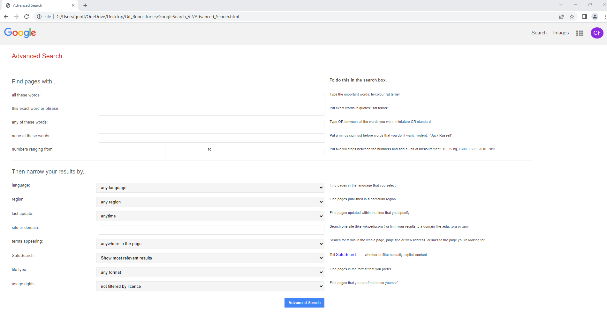

# Google Search website

This project is deployed on Heroku (have patience since the instance is likely sleeping): <a href="https://static-site-geoff.herokuapp.com/index.html" target="_blank" rel="noopener">https://static-site-geoff.herokuapp.com/index.html</a>

A screencast of the project can be found here: <a href="https://youtu.be/NbiYeKpHp8g" target="_blank" rel="noopener">https://youtu.be/NbiYeKpHp8g</a>

A screencast of the project is available on YouTube:

This site attempts resembles the aesthetics, style and functionality of the Google Search main page, Google Image Search, and Google Advanced Search.

Some of the technologies used when building this project:

* Visual Studio Code
* Git
* HTML
* CSS
* Heroku

-------------------

This project meets the following requirements:

* Three pages: one for regular Google Search (which is called *index.html*), one for Google Image Search, and one for Google Advanced Search.
    * On the Google Search page, there are links in the upper-right of the page to go to Image Search or Advanced Search. On each of the other two pages, there is a link in the upper-right to go back to Google Search.

* On the Google Search page, the user can type in a query, click “Google Search”, and be taken to the Google search results for that page.
    * Like Google’s own, the search bar is centered with rounded corners. The search button is also centered, and is beneath the search bar.

* On the Google Image Search page, the user can type in a query, click a search button, and be taken to the Google Image search results for that page.

* On the Google Advanced Search page, the user can provide input for the following four fields (taken from Google’s own advanced search options)
    * Find pages with… “all these words:”
    * Find pages with… “this exact word or phrase:”
    * Find pages with… “any of these words:”
    * Find pages with… “none of these words:”

* Like Google’s own Advanced Search page, the four options are stacked vertically, and all of the text fields are left aligned.
    * Consistent with Google’s own CSS, the “Advanced Search” button is blue with white text.
    * When the “Advanced Search” button is clicked, the user is taken to the search results page for their given query.

* The “I’m Feeling Lucky” button on the main Google Search page is consistent with Google’s own behavior. Clicking this link takes users directly to the first Google search result for the query, bypassing the normal results page.
    * You may encounter a redirect notice when using the “I’m Feeling Lucky” button, but this is an expected consequence of a security feature implemented by Google.

* The CSS resembles Google’s own aesthetics.

## Google Search:

## Image Search:

## Advanced Search:

